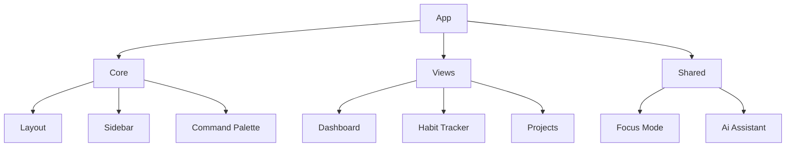

# Crystal OS (Personal Dashboard Evolution)

A high-density, AI-powered personal operating system designed for focus, consistency, and professional grade utility. Built with React, Supabase, and a custom neural-aesthetic design system.

 <!-- Replace with actual image in final repo -->

## 🚀 Technical Differentiators

This isn't just a dashboard; it's a modular application architecture demonstrating modern frontend engineering:

- **Intelligence Layer**: Integrated `Tactical Advisor` engine providing data-driven insights and AI-powered foresight.
- **Real-time Synchronization**: Full-stack reactivity using Supabase Realtime for cross-device state consistency.
- **Deep Work Protocols**: Immersive Focus Mode with ambient soundscapes and tactical data overlays.
- **Modular Atomic Design**: Reorganized architecture for maximum scalability and maintainability.
- **High-Density UI**: Industrial, cyberpunk-inspired aesthetic focusing on information density and micro-interactions.

## 🛠️ Tech Stack

- **Frontend**: React 18, Zustand (State), Framer Motion (Animations), Lucide React (Icons), Tailwind CSS (Layout/Spacing).
- **Backend**: Supabase (Database, Auth, Real-time).
- **Analytics**: Recharts based velocity tracking and custom SVG heatmaps.

## 📁 Architecture Overview



## ⚡ Key Features

1.  **Command Console**: Global search and quick-action palette (Cmd+K).
2.  **Tactical Grid**: Daily schedule manager with temporal alignment tracking.
3.  **Consistency Map**: Habit logging with 90-day heatmap and "thought capture" mechanics.
4.  **Operational Velocity**: Real-time graphing of mission completion rates.
5.  **Secure Protocols**: Integrated Supabase Auth with persistence hardening.

## 🛠️ Setup & Local Deployment

1.  **Clone the repository**.
2.  **Install dependencies**: `npm install`.
3.  **Environment Variables**: Create a `.env` file with your credentials:
    ```env
    VITE_SUPABASE_URL=your_project_url
    VITE_SUPABASE_ANON_KEY=your_anon_key
    ```
4.  **Launch**: `npm run dev`.

---
*Created for the Flagship Portfolio Elevation Phase.*
